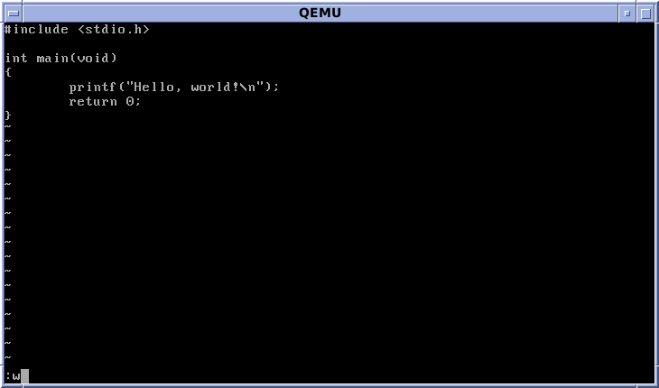

## **Definition - What does File System mean?**
A file system is a process that manages how and where data on a storage disk, typically a hard disk drive (HDD), is stored, accessed and managed. It is a logical disk component that manages a disk's internal operations as it relates to a computer and is abstract to a human user.

## **What is vi?**
The vi editor (short for visual editor) is a screen editor which is available on almost all Unix systems. Once you have learned vi, you will find that it is a fast and powerful editor. vi has no menus but instead uses combinations of keystrokes in order to accomplish commands.
vi (pronounced "vee-eye") is short for "vi"sual editor. It displays a window into the file being edited that shows 24 lines of text.
vi lets you add, change, and delete text, but does not provide such formatting capabilities as centering lines or indenting paragraphs.

## **What is linux** 
Linux is a family of open source Unix-like operating systems based on the Linux kernel,an operating system kernel first released on September 17, 1991, by Linus Torvalds.Linux is typically packaged in a Linux distribution.
 
## **Linux Commands**
## ***1. cd***

This is a unix command used to change directory or enter into specific directory!

## ***2. mkdir***
This command is used to make directory

## ***3. cp***
This command is used to copy files and directories.Here file pback.jpg is copied into the folder miniproject

## ***4. pwd***
This command shows the current working directory

## ***5. mv***
This command moves files or directories from one place to another

 

## ***6. rm***
This command is used to remove objects or computer files from a folder or path.Here file test is created and using the command rm file test is deleted

## ***7. Home directory***
A home directory, also called a login directory that serves as the repository for a user's personal files, directories and programs. It is also the directory that a user is first in after logging into the system.

## ***8. History Command***
This command shows the history.When the command is issued with no options, it prints the history list

## ***9. File paths in Linux***
A file path is the human-readable representation of a file or folder’s location on a computer system. This screenshot shows the file path for this Linux Command file within my computer.

## ***10. Using the tab key to complete file paths***
The tab key allows you to complete a file path without having to type it all out.It only works if you are in a directory that has the directory or path you plan to change to.For example,here in first picture the user wants to switch  in documents

In the above picture the command written is cd doc.Now with tab you can simply see the directories starting with name doc so you dont have to write the full name

## ***11. Using up and down arrow for history***
The up and down arrow keys allows you retrieve and use commands that you have used in the same Terminal window. Instead of typing a command again, you can simply use either the up or down key to retrieve this command

